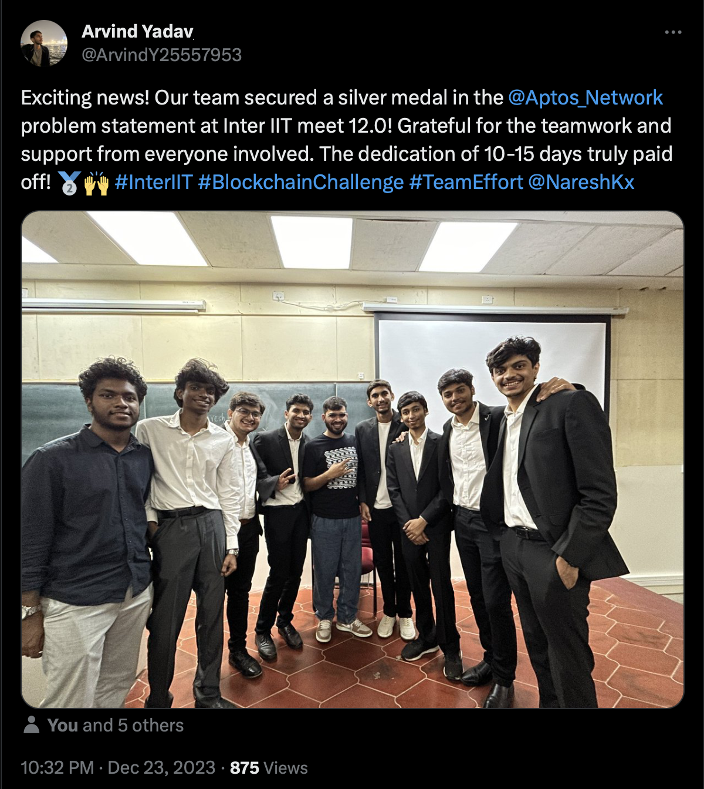
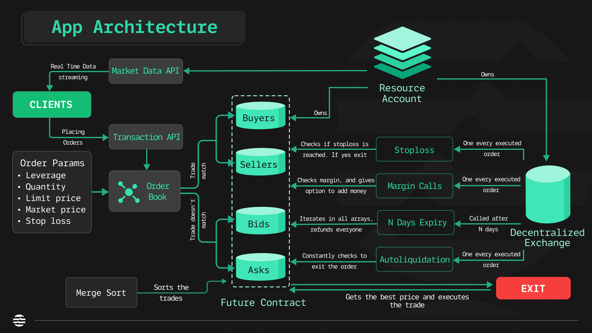

</img> 

# [Futures on Chain](https://github.com/t-Team-18/futures0xC)
> **Silver Medalist 🥈** submission in Aptos Labs Blockchain Development Hackathon conducted at InterIIT Tech Meet 12.0 | December 2023

### Team:


Futures on Chain is a decentralized futures trading platform built on top of the Aptos Blockchain. It has both a DEX (Decentralized Exchange) for the underlying commodity and a Futures Trading Platform built into it. The repository consists of a Frontend Website to interact with the contract using the browser wallet, two APIs for real time market data and order placing.

## Table of Contents

- [Futures on Chain](#futures-on-chain)
  - [Table of Contents](#table-of-contents)
  - [Getting Started](#getting-started)
    - [Prerequisites](#prerequisites)
    - [Installation](#installation)
  - [Usage](#usage)
  - [Implementation Details](#implementation-details)

## Getting Started

These instructions will help you get a copy of the project up and running on your local machine.

### Prerequisites

  Before you begin, make sure you have the following installed:
  - #### Frontend
    - Node.js
    - React.js
    - yarn/npm (**yarn recommend**)
  - #### Smart Contract
    - [aptos-cli](https://aptos.dev/tools/aptos-cli/) (package)
    - [aptos-sdk](https://aptos.dev/sdks/python-sdk) (python)
### Installation
- #### Frontend
  1. Clone the repository:

      ```
      git clone https://github.com/me/your-repositry
      ```

  2. Change to the project directory:

      ```
      cd your-repository/frontend
      ```

  3. Install the dependencies:

      ```
      yarn install
      ```
  4. Populate env 
     1. If you have deployed your own smart contract then populate the corresponding env variable with your own addresses.
     2. If you want to use our deployed smart contracts the use the env file as is.
     ```
      VITE_APP_NETWORK=devnet // it can devnet or mainnet
      // module address for multiple future contracts
      VITE_APP_MODULE_ADDRESS_24H=
      VITE_APP_MODULE_ADDRESS_48H=
      VITE_APP_MODULE_ADDRESS_72H=
     ```


- #### Smart Contract
    Do this only if you want to make your own smart contracts.
    1. Change to the project directory:
   
        ```
        cd your-repository/move
        ```
    2. Run this command

        ```
        aptos move create-resource-account-and-publish-package --profile [your-own-profile] --address-name Team18 --seed [any-random-number] --named-addresses source_addr=[your-own-source-address]
        ```  


## Usage

- You can place orders and get real time market data using the frontend GUI (**Graphical User Interface**) or the one deployed [Link]().

- You can also use the public API provided (or host your own) for market data and use the CLI for making transactions with the exchange  
    1. ##### Market Data API
        Provides real-time market data, including the current price, trading volume, and order book depth for all available futures contracts.
Further details about CLI can be found [here](https://github.com/t-Team-18/futures0xC/tree/main/market-api/README.md)
    1. ##### Transaction CLI
        Facilitates all financial transactions related to the buying and selling of futures contracts, as well as margin calls and settlements through a CLI.
Further details about CLI can be found [here](https://github.com/t-Team-18/futures0xC/tree/main/transaction-api/README.md)

## Implementation Details



## Presentation Link

Click [here](https://drive.google.com/file/d/19EcxHgoRgxPj2fVTqyghJm2dEKWvlDyh/view?usp=sharing) to view the full presentation!

## Demo Video Link
Click [here](https://drive.google.com/file/d/1S7TsyNjqOf85gCzZZN_qazOKyxxFSftp/view?usp=sharing) to see a working demo!

To learn more about Aptos, click [here](https://aptos.dev/).
